# Oyun
Veri Analitiği Projesi - Muhammet Uzun

## **1. Break-Even Point noktası için maksimum CPI kaç olmalıdır? Yorumlayınız**

### CEVAP

**En Yüksek Max CPI**: 2023-04-11 tarihinde bulunan **$0.46**

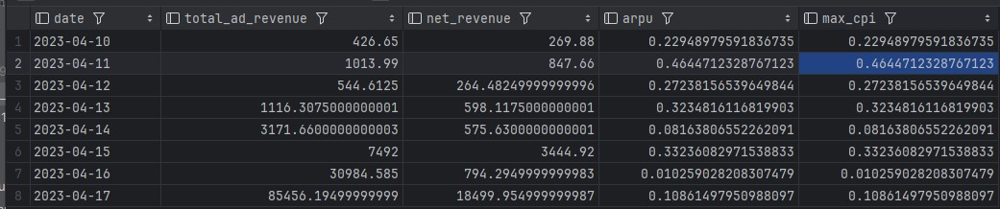

**Peki sonuca nasıl vardım?** 

### SÜREÇ

Break-Even Point için maximum CPI hesaplamak için gereken formül; 

**Maximum CPI = Ortalama Günlük Gelir / Ortalama Günlük Kurulum Sayısı** idi.

**Fakat** verilen tablodaki değerler arasında net bir gelir bilgisi yoktu. CPI'a etki eden diğer etkenleri dikkate alıp başka bir formül geliştirmem gerekti. Bu sebepten ötürü, reklam gösterim sayıları ile CPM arasında bir ilişki kurarak ortaya bir **reklam geliri** çıkardım.

Bu **Toplam Ad Impression (ödüllü, banner ve interstitial) ile her biri için olan CPM’lerin çarpımı** ile eldi edildi.

Bununla birlikte **payda**ya yazacağımız değer konusunda ilk etapta tereddütlerim oluştu. Daha doğrusu formülü nasıl genişletebileceğimi ve maximum CPI’ı bütün tabloyu göz önünde tutarak en olası değeri tespit edeceğimi sorguladım. 

Bunun için yapıyı **DAU** üzerinden mi yoksa **Total installs** üzerinden mi kurgulamam gerektiği konunda kararsız kaldım. Yaptığım denemeler, araştırmalar ve derste bu ikisi arasındaki tercih konusunda yaptığınız açıklamalardan dolayı Total Installs ile devam etmeye karar verdim. 

Bunun nedeni Total Installs’ın daha geniş, genel bir bakış sağlayacak olmasıydı. Bununla birlikte DAU’dan aldığım sonuçlar oldukça yüksekti ve bu sonuçlar üzerinden genel bir strateji belirlenemeyeceğini düşündüm.

**DAU vs Total Installs Karşılaştırması**

- DAU üzerinden yaptığım denemelerde oldukça yüksek sonuçlar elde ettim ve bunun genel bir strateji oluşturmak için uygun olmadığını fark ettim. Çünkü DAU daha çok kısa vadeli etkilere odaklanırken, Total Installs daha geniş bir bakış açısı sunuyordu.
- **Total Installs**'ı kullanmak, daha kapsamlı ve genel bir sonuca ulaşmamı sağladı. Bu nedenle **Total Installs**'ı formülün paydasına eklemeye karar verdim.

**Retention ve Diğer Faktörler**

Bu iki metriğin yanında oyuncuların **oyunda geçirdikleri süre**lerin ve **retention oranları**nın da **ağırlıklandırarak** reklam gelirlerine etki edeceğini düşünüp formüle dahil etmek istedim ancak hem formülün yapısını karmaşıklaştırıyorlardı, hem de dolaylı yoldan bir etkileri vardı. Bu yüzden formüle dahil etmenin kafa karıştıracağına karar verip **vazgeçtim**.

Buraya kadarki işlemlerin sonucu olarak Total Installs’ı paydaya yazdığımda aldığım **en yüksek max CPI : 2023-04-15 tarihinde bulunan $0.61’**di.

**Paid Installs Kararı**

**Ancak** reklam harcamalarının geri dönüşünü daha doğrudan analiz edebilmek için total Installs yerine **Paid Installs** üzerinden hareket edilmesi gerektiğine karar verdim ve denemelerimi bunun üzerinden yaptım. Benim açımdan buradaki **kritik nokta**, sadece reklam harcamaları ile elde edilen kullanıcıların maliyetine odaklanmaktı. **Organik** bir şekilde gelen kullanıcılar analizi bozardı.

**Paid installs** üzerinden yapılan bu hesaplamada **maximum CPI’ımı $0.72 ‘**a kadar sürdürülebilir olduğunu tespit ettim.

**Marketing Cost ve Net Gelir**
Bu noktaya geldikten sonra analizde önemli bir parçanın eksik olduğunun farkına vardım:  **Marketing Cost !**
Marketing maliyetleri, kullanıcı başına maliyetleri, haliyle BEP hesaplamalarını etkileyecektir. Pazarlama maliyetimiz yüksekse, BEP’e ulaşmak için daha fazla gelir veya daha düşük CPI gerekebilir.

Bu karar sonuncda maaximum CPI formülünü bir **net gelir** üzerinden tekrar kurguladım. Yani **Net Gelir=Toplam Reklam Geliri−Marketing Cost** olarak.

## SONUÇ

- Pazarlama giderlerini dahil ederek yaptığımız hesaplamalara göre, BEP için **maksimum CPI 2023-04-11 tarihinde 0.46 USD** olarak belirlenmiştir.
- Bu hesaplamalar, **Paid Installs** üzerinden yapılmış olup, **Marketing Cost** dahil edilerek sonuçlandırılmıştır.

**Kullanılan SQL Sorgusu:**

```sql
SELECT
    date,
    -- Toplam Reklam Geliri
    ((ad_impression_rewarded * cpm_rewarded) / 1000) +
    ((ad_impression_interstitial * cpm_interstitial) / 1000) +
    ((ad_impression_banner * cpm_banner) / 1000) AS total_ad_revenue,

    -- Net Gelir
    (((ad_impression_rewarded * cpm_rewarded) / 1000) +
    ((ad_impression_interstitial * cpm_interstitial) / 1000) +
    ((ad_impression_banner * cpm_banner) / 1000)) - marketing_cost AS net_revenue,

    -- ARPU
    (((ad_impression_rewarded * cpm_rewarded) / 1000) +
    ((ad_impression_interstitial * cpm_interstitial) / 1000) +
    ((ad_impression_banner * cpm_banner) / 1000) - marketing_cost) / install_paid AS arpu,

    -- Max CPI
    (((ad_impression_rewarded * cpm_rewarded) / 1000) +
    ((ad_impression_interstitial * cpm_interstitial) / 1000) +
    ((ad_impression_banner * cpm_banner) / 1000) - marketing_cost) / install_paid AS max_cpi
FROM
    q1_daily_metrics;
```

## 2. Her gün için reklam gelirinde ARPDAU kaçtır? Yorumlayınız.

### CEVAP

Her gün için ARPDAU (günlük aktif kullanıcı başına ortalama gelir) sonuçları şu şekilde:

- **04-10-2023**: 0.35
- **04-11-2023**: 0.42
- **04-12-2023**: 0.30
- **04-13-2023**: 0.36
- **04-14-2023**: 0.34
- **04-15-2023**: 0.44
- **04-16-2023**: 0.34
- **04-17-2023**: 0.35

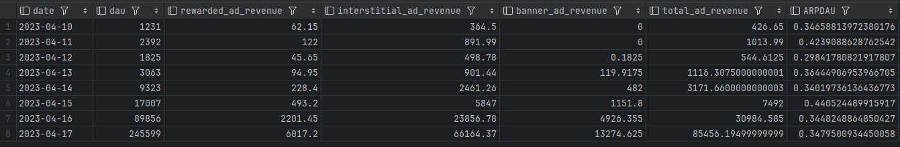

### SÜREÇ

ARPDAU , günlük aktif kullanıcı başına ortalama geliri hesaplamak için, reklam gelirlerini (Ad Impression gelirleri) toplam günlük aktif kullanıcı sayısına (DAU) bölmeliyiz

Bir önceki soruda olduğu gibi elimizde net bir gelir olmadığı için **Gelir = (Ad Impression Sayısı / 1000) x CPM** formülünden hesaplayarak buldum. Bunu her bir reklam türü için yaptım.

Daha sonra formülü uyguladığımızda çıkan sonuçlar yukardaki gibi oldu.

### YORUM

Sonuçlara baktıktan sonra benim ilk dikkatimi çeken **ARPDAU ve DAU arasındaki ilişki** oldu. Örneğin; **04-17-2023** tarihinde, DAU (**245,599**) ile büyük bir artış görüyoruz, ancak **ARPDAU** sadece **0.38**. Bu, çok fazla kullanıcı olmasına rağmen kişi başına gelirde büyük bir artış olmadığını gösteriyor. **04-15-2023** tarihine baktığımızda ise DAU (**17,007**) çok daha düşükken, ARPDAU **0.44** ile daha yüksek. Bu da daha az kullanıcı olsa bile o gün daha fazla gelir elde edildiğini, çünkü kullanıcıların daha fazla reklam izlediğini veya daha yüksek getirili reklamların gösterildiği anlamına geliyor.

**ARPDAU düşük olsa bile daha fazla aktif user'a etki ettiği için daha çok kazanç getirebiliyor.**

Örnek verecek olursam;

- 04-17-2023 Örneği (**DAU yüksek, ARPDAU düşük**):
    
    **DAU**: 245,599
    **ARPDAU**: 0.38
    **Toplam Gelir**: 245,599 x 0.38 = **$93,327,62**
    
- 04-15-2023 Örneği (**DAU düşük, ARPDAU yüksek**):
**DAU**: 17,007
**ARPDAU**: 0.44
**Toplam Gelir:** 17,007 x 0.44 = **$7,483,08**

Bu sonuçlar bana düşük ARPDAU ile daha büyük bir kullanıcı kitlesine ulaşılarak kazancın optimize edilebileceğini gösteriyor. DAU ne kadar büyük olursa, düşük bir ARPDAU bile toplam kazancı artırabilir. DAU düşük olduğunda ise, ARPDAU ne kadar yüksek olursa olsun toplam gelir yine sınırlı kalır. Ancak duruma, sorumuzun yani ARPDAU’nun özelinde bakacak olursak, **ARPDAU'nun yüksek olması**, **daha verimli bir gelir modeli oluşturduğumuz** anlamına gelir. 

Yine bunlarla beraber **kullanıcının ne kadar zaman geçirdiği, retention** gibi metrikler de ARPDAU’ya etki edebilecek metriklerdendir. Örneğin; 04-14-2023’te **DAU başına ortalama tamamlanan seviye** 9.1, ancak 04-16-2023’te bu oran 9.4’e yükselmiş. Bu artış, kullanıcıların platformda daha fazla zaman geçirdiğini ve daha fazla gelir sağladığını gösterir. Ayrıca, 04-16-2023'te toplam oturum sayısı (335,394) oldukça yüksek ve bu durum daha fazla reklam gösterimi (özellikle rewarded ads) anlamına gelebilir. Sonuç olarak, bu tür artışlar ARPDAU'yu yükseltebilir.

Aynı şekilde pazarlama maliyetleri de benzer yaklaşımlarla okunabilir. Ancak soru ARPDAU özelinde olduğu için çok yorumu çok genişletmek istemiyorum.

**Kullanılan SQL Sorgusu:**

```sql
SELECT
    Date,
    dau,
    -- Her reklam türü için toplam gelir hesaplama
    ( (ad_impression_rewarded * cpm_rewarded) / 1000 ) AS rewarded_ad_revenue,
    ( (ad_impression_interstitial * cpm_interstitial) / 1000 ) AS interstitial_ad_revenue,
    ( (ad_impression_banner * cpm_banner) / 1000 ) AS banner_ad_revenue,
    -- Toplam reklam geliri hesaplama
    ( (ad_impression_rewarded * cpm_rewarded) / 1000 +
      (ad_impression_interstitial * cpm_interstitial) / 1000 +
      (ad_impression_banner * cpm_banner) / 1000 ) AS total_ad_revenue,
    -- ARPDAU hesaplama (Toplam reklam geliri / DAU)
    ( ( (ad_impression_rewarded * cpm_rewarded) / 1000 +
        (ad_impression_interstitial * cpm_interstitial) / 1000 +
        (ad_impression_banner * cpm_banner) / 1000 ) / dau ) AS ARPDAU
FROM
    q1_daily_metrics;
```

## PARÇA 2

**$10 CPI ile yapılan bir pazarlama kampanyasından 1000 oyuncu elde edildiğini ve bu oyuncular için Day 1 retention %50 olduğunu varsayalım (yani oyuncuların yarısı oyunu yükledikten bir gün sonra tekrar açmaktadır). Day 2 retention oranı %49. Day 3 retention %48'dir ve bu durum hiç kimse oyunu bir daha oynamayana kadar %1'lik düşüşlerle devam eder (51. Gün retention %0'dır**

---

---

---

**1. Başa baş noktasına (break even point) 50. günde ulaşılması için ortalama günlük ARPDAU (Günlük aktif kullanıcı başına ortalama gelir) ne olmalıdır? (Günler boyunca sabit olduğunu varsayalım)**

### CEVAP

50 gün boyunca her gün **ortalama $0.784** gelir elde edersek, toplam pazarlama maliyeti olan $10,000 karşılanabilir. ve 50 gün boyunca günlük aktif oyuncu sayılarının toplamı **12,750**’dir

### SÜREÇ

Soruyu gördüğümde aklıma ilk gelen **retention modelleme** kısmında gördüğümüz **Tn = T0 * 0.5^n + Tn-1** formülünü soruya uygulayarak çözmekti. Bunu da yaptım aslında. Bunu yapınca cevabım 50 gün boyunca toplam günlük aktif kullanıcı sayısı: **49,000** ve Başa baş noktasına ulaşmak için gerekli ortalama günlük aktif kullanıcı başına gelir (ARPDAU): **$0.204** şeklinde oldu.
Daha sonra python’da aldığım output’daki görüntü beni biraz kuşkulandırdı ve ikinci kez düşünmeye itti. Bu sürede **kümülatif bir işlem yapmamam** gerektiğini anladım.

Daha sonra **manuel olarak** süreci tekrar ele almaya karar verdim.
**Aşamalar:**

Elimizde $10’lık bir CPI, Toplam oyuncu sayısı = 1000,  D1 %50, D2 49, D3 %48 şeklinde her gün %1 sabit azalanla 51. günde 0’ı bulan retention oranlarımız ve 50. günün sonunda toplam gelirin $10,000’lık (Toplam Pazarlama Maliyeti = 1000 oyuncu x 10 dolar = 10.000 dolar) pazarlama maliyetini karşılaması gereken bir **hedef**imiz var.

**Gün 1**: %50 retention → 1000 oyuncunun 500'ü aktif oyuncu.
**Gün 2**: %49 retention → 1000 oyuncunun 490'ı aktif oyuncu.
**Gün 3**: %48 retention → 1000 oyuncunun 480'i aktif oyuncu.
Bu şekilde 50. güne kadar her gün %1'lik bir düşüşle 10 aktif oyuncuya kadar geldik.

**Toplam günlük aktif kullanıcı sayısını bulmak için** 50 günlük oyuncu sayılarını topladık ve 12,750 sayısına ulaştım. Bu 50 gün boyunca aktif olan oyuncuların toplam sayısıydı.
Ve sonunda gerekli **ARPDAU** ‘yu hesaplamak için her şey hazırdı.
BEP noktasına ulaşmak için:

**Toplam Gelir = Toplam Günlük Aktif Kullanıcı Sayısı x ARPDAU**

ve

**ARPDAU = Toplam Pazarlama Maliyeti / Toplam Günlük Aktif Kullanıcı Sayısı**

= 10,000 / 12,750 

**= 0.784**

## SONUÇ

50 gün boyunca her gün **ortalama $0.784** gelir elde edersek, toplam pazarlama maliyeti olan $10,000 karşılanabilir.

**2. ARPDAU'nun sabit olduğunu varsaymak ne kadar gerçeği yansıtır? Eğer yansıttığını düşünüyorsanız neden? Yansıtmadığını düşünüyorsanız değişime sebep olabilecek varsayımlarınız ne olurdu?**

İlk bakışta söyleyebileceğim şey gerçek dünyada ARPDAU’nun sabit kalamayacağıdır. Aklıma sabit kalabileceği yalnızca bir senaryo geliyor. O da **abonelik sistemi**nin olduğu bir oyun. Ayrıca bu oyunun her gün %1 oyuncu kaybedeceğini, bu düşüşü karşılamak için de diğer oyunculardan gelen gelirlerin belirli oranlarda artırılacağı gibi kurallarının olduğunu **hayal** edebiliriz. Ve bu oyun belirli bir oyuncu sayısıyla başlayacak ve belirli gün sonra bitecek. Bu kadar. 

Böyle hayali bir senaryo haricinde aklıma ARPDAU’nun sabit olduğu durumlar **gerçekçi gelmemekte**.

Gerçeği yansıtmayacağını düşündüğüm senaryolar üzerinden konuşacak olursam, ilk söylemem gereken **oyuncuların satın alım davranışlarının sabit olamayacağı** olacaktır. Satın alım yapmadan oynayan oyuncular, balinalar, satın alanlar arasındaki değişkenlikler ARPDAU’nun sabit kalmasının önüne geçecektir. Karşı taraftan bakacak olursak da **satın alınan materyaller**in de fiyatlarındaki değişkenlik bu sabitliğin önüne geçen bir diğer etken olacaktır.

Aynı şekilde retention oranlarındaki günlük düşüş de bir dalgalanma yaratacaktır. ARPDAU’yu sabit tutabilmek için azalan günlük kullanıcılarla gelirleri dengeleyen bir fiyat optimizasyon modelinin var olması gerekecektir ki bu gerçek hayatta uygulaması zor görünüyor. Ayrıca bu, gün geçtikçe oyuncu üzerindeki mali yükü arttırır. Oyuncuların zamanla harcama yapmaya isteksiz olacaklarından, bu ancak iki taraf arasında önceden yapılmış bir anlaşmayla mümkün olabilir gibi geliyor bana. 

Sadece bu metriklerin dışında bile ARPDAU’yu etkileyecek oyuncu, pazar ve strateji bazlı bir sürü etken olacaktır. Bu sebepten **ARPDAU’nun sabit olduğu varsayımının gerçeği yansıtmadığını** düşünüyorum.

### SONUÇ

Tabiri caizse bir oyun organik yapıdadır, sürekli hareket halinde olan bir çok boyuta sahiptir, Tüm bu hareketlilik ve değişen durumlar ARPDAU gibi bir metriğin sabit kalmasının önüne geçer. ARPDAU'nun sabit kalması ancak çok sınırlı ve dikkatle kontrol edilen senaryolarda mümkündür. Abonelik sistemleri gibi sabit gelir modelleri bu duruma uygun olabilir, ancak oyuncu kayıpları ve yeni oyuncu kazanımı, fiyat stratejileri ve içerik güncellemeleri gibi pek çok faktör bu sabitliği tehdit eder. Gerçek dünyadaki oyun dinamiklerinde, oyuncu davranışları, pazar koşulları ve oyun içi ekonomik değişiklikler ARPDAU'nun sürekli dalgalanmasına neden olacaktır.

## PARÇA 3

Aşağıdaki tablolar sadece 2023-10-01 ve 2023-11-30 tarihleri arasında oyunu indiren oyuncuların verilerini içermektedir. 

**currency_changes :** Oyundaki günlük kullanıcıların tüm
currency değişiklik eventlerini içerir
**stage_events:** Oyunda oyuncular her bölüm (stage) hareket eventlerini içerir.
**user_states:** Oyunda ekran geçişlerinde gönderilen ve oyuncunun o an mevcut durumunu gösteren eventler.
**users :**Oyuncu tablosu
**users_daily :** O gün oyuna giren aktif oyuncuların günlük bazda bazı verilerinin hesaplandığı tablo

**1. Günlük DAU hesabı yapmak istediğinizde hangi tabloyu kullanmanız uygundur? Bu tabloyu kullanarak DAU hesaplayınız ve görselleştiriniz.**

## CEVAP

Günlük DAU hesaplamak için elimizdeki tablolardan **users_daily** tablosu kullanılmaya en uygun tablodur. 

```sql
SELECT
    event_date,
    COUNT(DISTINCT user_id) AS DAU
FROM
    users_daily
GROUP BY
    1
ORDER BY
    1;
```

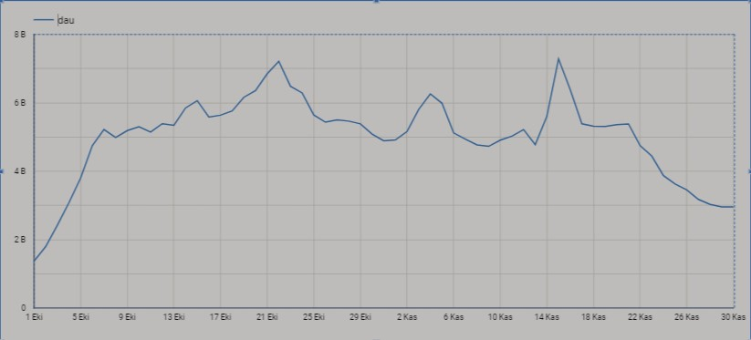

### YORUM

Bu zaman serisi grafiğine baktığımız zaman çeşitli dalgalanmalar, ani yükselişler ve düşüşler olduğunu rahatlıkla görebiliyoruz. Örneğin, bir önceki gün 5220 iken, 2023-10-08'de DAU 4984'e inmiş. 

Bu durumları anlamak için ilk akla gelen, **etkinlik, kampanya ya da tatil/haftasonu** gibi durumların bu dalgalanmalara sebep olup olmadığı. Ancak elimizdeki verilere baktığımızda herhangi bir kampanya ya da etkinliği kontrol edemiyoruz. Bu tam da derslerde bahsettiğimiz ‘gidip pm’e sorulmalı’ noktası diye düşünüyorum. 

Bununla birlikte biraz daha incelemek istedim DAU’yu etkileyebilecek durumları. Retention oranlarının nasıl etkileyebileceği üzerinde durdum. DAU’nun yüksek ya da düşük olduğu durumlardaki retention oranlarını anlamaya çalıştım. Ancak bunu anlayabilmek için her güne ayrı bir cohort oluşturmam gerekiyor gibi geldi ve açıkçası bunun içinden çıkamadım. 

Aynı şekilde segmentlere ayırmanın ve currency_change sütunundaki hareketler üzerinde çalışarak çıkarılacak sonuçların da DAU’yu incelerken işe yarayabileceğini düşündüm, biraz inceledim ancak sorudan ve cevaptan çok uzaklaştığımı fark ettim ve bıraktım. Bu konuda en işe yarar çaba **DAU için günlük değişim oranları**nı bulmak oldu. Örneğin, 2023-11-03'te %12,54'lük bir artış varken, hemen ardından 2023-11-06'da %14,46'lık bir düşüş yaşanıyor. Benzer şekilde, 2023-11-16'da %12,34'lük düşüş, ardından %15,64'lük bir düşüş daha var. Kasım ayının sonlarına doğru verilerde istikrarlı bir düşüş görülüyor (11-22'den itibaren).

### **2. Oyunda günlük conversion rate nedir? Yorumlayınız?**

## **CEVAP**

[Untitled](Untitled%201081dbe134d980818600c9819ecd02ed.csv)

```sql
SELECT
    event_date,
    COUNT(DISTINCT CASE WHEN user_spent > 0 THEN user_id END) AS paying_users,
    COUNT(DISTINCT user_id) AS active_users,
    (COUNT(DISTINCT CASE WHEN user_spent > 0 THEN user_id END) / 
     COUNT(DISTINCT user_id)) * 100 AS conversion_rate
FROM
    `game-analysis-01.project_game_v2.users_daily` ud
GROUP BY
    1
ORDER BY
    1;
```

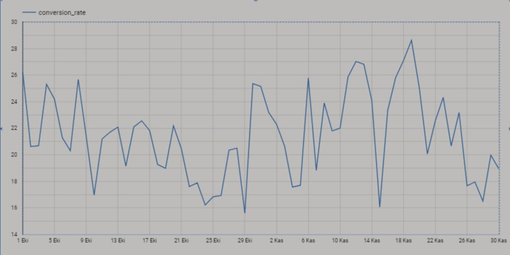

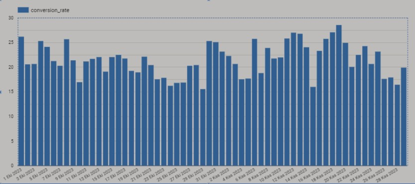

## YORUM

Bazı günlerde ödeme yapan kullanıcı sayısında **dalgalanmalar** var. Örneğin, 2023-10-01'de 36 ödeme yapan kullanıcı varken, bu sayı 2023-11-19'da 152'ye yükselmiş. Bu artış bir kampanya veya etkinlik sonucunda olabilir. Aktif kullanıcılarda da dalgalanmalar olduğunu ilk soruda gözlemlemiştik. İlk soruda olduğu gibi bu soruda da kampanya veya etkinlik verisi olmadığı için bunları tespit edemiyoruz ancak yine de elimizdeki veri setiyle çeşitli kıyaslamalar yapılarak analiz genişletilebilir.

Cevap çıktısında yok ama ödeme yapan kullanıcıların aktif kullanıcıya oranları %1.5 - %2.8 arasında değişişyor. Bu da bazı dalgalanmalar dışında dönüşüm oranlarının **stabil** olduğunu gösteriyor.

İki ayın yani Ekim ve Kasım aylarının da sonlarına doğru düşüşler oluyor. **Mevsimsellikten şüphelenebiliriz**.

### 3. Oyuncuların en fazla zorlandığı stage (oyun bölümü) hangisi olabilir? Kendi tespitinizi ve yorumunuzu paylaşın.

## CEVAP

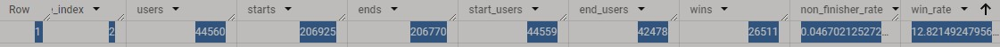

Aşağıda kodları ve çıktılarını paylaştığım kısımda iki farklı yoldan (win_rate ve failure_rate) giderek bir bakıma sağlamasını yapmış oldum. Ancak soruda en zor stage’i sorduğu için bu sonuçları değil de **en düşük win_rate’e sahip olan 2. stage’i** seçtim.

Ayrıca burada oyuncuların aldıklları hasarların yüksekliği oldukça dikkatimi çekti, anomali olmasından kuşkulandırdı ancak oyunun yapısı gereği bu denli hasar almanın doğal olduğuna kanaat getirdim bu yüzden müdahale etmedim.

En alttaki görsel de Google Sheets’te hazırlanmış olan tablo. Lütfen ilk iki hanedeki sayıları yüzdelik oran olarak alınız. Uğraştımsa da bu çıktıyı düzeltmeyi başaramadım. 

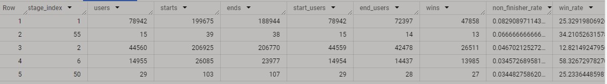

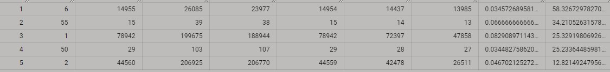

Birinci Sorgu:

```sql
WITH t1 AS (
    SELECT
        CAST(stage_index AS INTEGER) AS stage_index,
        COUNT(DISTINCT user_id) AS users,
        COUNTIF(event_type = 'stage_start') AS starts,
        COUNTIF(event_type = 'stage_end') AS ends,
        COUNT(DISTINCT IF(event_type = 'stage_start', user_id, NULL)) AS start_users,
        COUNT(DISTINCT IF(event_type = 'stage_end', user_id, NULL)) AS end_users,
        COUNT(DISTINCT IF(event_type = 'stage_end' AND LOWER(result) = 'win', user_id, NULL)) AS wins
    FROM
        game-analysis-01.project_game_v2.stage_events
    WHERE
        event_type LIKE 'stage%'
    GROUP BY
        stage_index
)

SELECT 
    1 - (end_users / start_users) AS non_finisher_rate,
    (wins / ends) * 100 AS win_rate
FROM 
    t1
ORDER BY 
    non_finisher_rate;
```

İkinci Sorgu:

```sql
WITH t1 AS (
    SELECT
        CAST(stage_index AS INTEGER) AS stage_index,
        COUNT(DISTINCT user_id) AS users,
        COUNTIF(event_type = 'stage_start') AS starts,
        COUNTIF(event_type = 'stage_end') AS ends,
        COUNT(DISTINCT IF(event_type = 'stage_start', user_id, NULL)) AS start_users,
        COUNT(DISTINCT IF(event_type = 'stage_end', user_id, NULL)) AS end_users,
        COUNT(DISTINCT IF(event_type = 'stage_end' AND LOWER(result) = 'win', user_id, NULL)) AS wins
    FROM
        game-analysis-01.project_game_v2.stage_events
    WHERE
        event_type LIKE 'stage%'
    GROUP BY
        stage_index
)

SELECT 
    stage_index,
    users,
    starts,
    ends,
    start_users,
    end_users,
    wins,
    1 - (end_users / NULLIF(start_users, 0)) AS non_finisher_rate,
    (wins / NULLIF(ends, 0)) * 100 AS win_rate
FROM 
    t1
ORDER BY 
    non_finisher_rate DESC
LIMIT 5;
```

.png)

Görseli Olan Tablonun Linki:

[results-20240921-171417](https://docs.google.com/spreadsheets/d/e/2PACX-1vRSNLxdClyJZE1GW7X6AE3F7Xudh-QsoWxY3F6IAUyE1NzBzDpbPgZSaHZir09hAyF-imDrDND8Nn6O/pubhtml?gid=428757168&single=true)

## 4. Günlük olarak ortalama ve medyan olarak oyuncuların günlük oyunda ne kadar zaman geçirdiğini görselleştiriniz.

## CEVAP

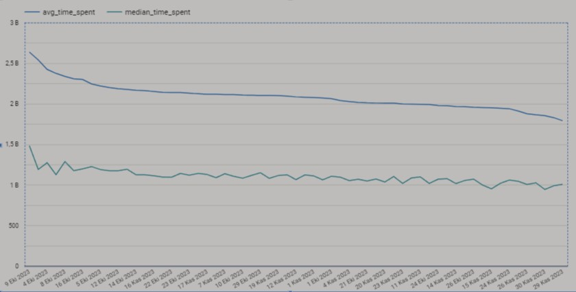

```sql
WITH daily_time_spent AS (
    SELECT
        event_date,
        time_spent_seconds
    FROM
        game-analysis-01.project_game_v2.users_daily ud
),
avg_time AS (
    SELECT
        event_date,
        AVG(time_spent_seconds) AS avg_time_spent
    FROM
        daily_time_spent
    GROUP BY
        event_date
),
median_time AS (
    SELECT
        event_date,
        APPROX_QUANTILES(time_spent_seconds, 2)[OFFSET(1)] AS median_time_spent
    FROM
        daily_time_spent
    GROUP BY
        event_date
)

SELECT
    a.event_date,
    a.avg_time_spent,
    m.median_time_spent
FROM
    avg_time a
JOIN
    median_time m ON a.event_date = m.event_date
ORDER BY
    a.event_date;
```

## 5. Mevcut verilere ve bilgilere göre sizce oyuncuların gem kazanabileceği en iyi kaynak hangisidir?

## CEVAP

Giriş yapma (**login**) kaynağı, diğer tüm kaynaklardan çok daha yüksek bir kazanıma sahip.  **8,402,743,580** gem kazanımı ile en yüksek değer. 

**Yeni kullanıcı görevleri (quest_new_user)** ile de oldukça fazla gem dağıtılmakta (**4,100,795,510)**. Ayrıca yine oyunun sunduğu **market_offer’**larla da oldukça fazla gem dağıtılmakta (**3,000,437,230**).

Ancak tepede duran bu en yüksek üç kalemin ortak özelliği bunları oyunun oyuncuya sunması. 

**Oyuncu olarak** gem kazanılabilecek en yüksek kalemleri ise; oyun içi **görevler (guest): 2003547460** ve **düşman öldürme (enemy_kill) : 1995516436** olarak ele alabiliriz.

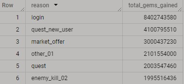

```sql
SELECT
    reason,
    SUM(CASE WHEN change_type = 'Gain' THEN CAST(currency_change_amount AS INT) ELSE 0 END) AS total_gems_gained
FROM
    game-analysis-01.project_game_v2.currency_changes
WHERE
    currency_type = 'Gem'
GROUP BY
    reason
ORDER BY
    total_gems_gained DESC;
```

## 6. Stage’lerin (Oyun bölümleri) ortalama ve medyan olarak kaç denemede geçildiğini hesaplayınız ve yorumlayınız.

## CEVAP

**Stage kırılımında bölümlerin ortalama ve medyan olarak kaç denemede geçildiğini tespit etmeye çalışıyorum.** 

[Untitled](Untitled%201091dbe134d980368e84fbd49e1ce4b8.csv)

```sql
WITH attempt_ranks AS (
    SELECT
        stage_index,
        stage_attempt,
        ROW_NUMBER() OVER (PARTITION BY stage_index ORDER BY stage_attempt) AS row_num,
        COUNT(*) OVER (PARTITION BY stage_index) AS total_attempts
    FROM
        game-analysis-01.project_game_v2.stage_events
    WHERE
        result = 'win' -- Sadece başarılı denemeleri dikkate alıyoruz
)
SELECT
    stage_index,
    AVG(CAST(stage_attempt AS NUMERIC)) AS avg_attempts, -- Ortalama deneme sayısı
    AVG(CASE 
            WHEN row_num IN (FLOOR((total_attempts + 1) / 2), CEIL((total_attempts + 1) / 2)) 
            THEN CAST(stage_attempt AS NUMERIC) 
            ELSE NULL 
        END) AS median_attempts -- Medyan deneme sayısı
FROM
    attempt_ranks
GROUP BY
    stage_index
ORDER BY
    avg_attempts DESC;
```

## YORUM

Bu tabloda ilk göze çarpan **100. stage** oluyor.  Bu stage’de ortalama ve medyan sayıları oldukça yüksek. Bu da oyuncuların ciddi şekilde zorlandığını gösteriyor. Bu stage’in bir diğer özelliği de **Ortalamanın medyandan küçük olduğu** nadir stage’lerden. Medyan daha küçük ve ortalama daha yüksekse, bazı oyuncuların belirli stage'lerde çok zorlandığını söyleyebiliriz. Bu duruma **7., 8., 9., 11., 13. stage**’leri de ekleyebiliriz.

Medyanın düşük ortalamanın da çok daha yüksek olduğu durumlarda bazı oyuncuların çok fazla deneme yaparak ortalamayı yükselttiği çıkarımında bulunabiliriz.

Ortalama ve medyanın dengede olduğu durumlarda ise oyuncuların bu bölümleri kolayca geçtiğinden ve oyunun kolay bölümlerinden olduğunu söyleyebiliriz.

Analizi genişletmek istediğimizde ise ilerleyen bölümlerdeki oyuncu sayısındaki azalmaları, oyuncu beceri ve ilerlemelerini, bölüm zorluklarını hesaba katarak analizler yapabiliriz.

## 7. Bir oyun veri analisti olarak oyunlarınızda bu hilelere yönelik hangi aksiyonları almayı düşünürsünüz?

## CEVAP

Bir veri analisti olarak hileler ve hilecilere yönelik ilk aksiyonum onların orada olduğunun **farkında olmak** olmalı diye düşünüyorum. Bu hileler yapacağım verilerimde **anomaliler** / **outlierlar (aykırı değerler)** oluşturacaktır. Bu sebeple onları özenle tespit etmeli ve incelemeliyim. Bu hilecilere karşı yaklaşımlar duruma göre değişiklik gösterebilir. **Oyunu bozuyorsa** ve **rekabeti etkiliyorsa** buna göre önlemler alınması gerekir. Ancak unutmamalıyız ki **hile yapanlar da bize veri üretiyor** ve oyunumuzu tanımamızda bize fayda sağlıyor olacaklar. Onları **ayrıca incelemeyi** sürdürebiliriz. 

Birinci sorumuzda çalışma yaparken **currency** ve  **harcamaların** 4 milyar, 6 milyar gibi değerlerinin olduğunu fark etmiştim. Bunlar verimi bozan ve analizlerimi, grafiklerimi etkileyen değerlerdi.

**Alınabilecek Aksiyonlar:**

- Ganimet kazanımları, oyuncu seviyeleri, kazanma oranları ve harcanan zaman gibi metriklerdeki aşırı sapmaları analiz etmek.
- Developer’larla temas kurup tespit edilen kriterlere göre **kısıtlamalar** getirmek.
- Rekabeti engelleyen durumda **hilecileri ihraç etmek** veya oyunda onlara göre tasarlanan alanlara, modlara yönlendirmek.
- Hilecileri **takip altında** tutmak ve onları ayrıca analiz etmek. **Segmentlere** ayırabiliriz.

**Örnek Çalışma:**

Aşağıdaki çalışmada `currency_change_amount` sütunu üzerinden giderek çok yüksek kazanç veya harcamaları tespit etmeye çalıştım. Analizimin kriterlerini standart sapmaya göre belirledim. Eğer bir kullanıcı ortalama değerden 3 standart sapma fazla veya düşük miktarda currency kazanmışsa, bu "High Anomaly" veya "Low Anomaly" olarak işaretledim. Bu sorgu bana **62148** satır sonuç döndürdü.

```sql
WITH anomaly_detection AS (
  -- Aykırı Değerleri Bulma
  SELECT
    cc.user_id,
    cc.event_date,
    cc.reason,
    CAST(cc.currency_change_amount AS FLOAT64) AS currency_change_amount_numeric,
    AVG(CAST(cc.currency_change_amount AS FLOAT64)) OVER (PARTITION BY cc.reason) AS avg_change_amount,
    STDDEV(CAST(cc.currency_change_amount AS FLOAT64)) OVER (PARTITION BY cc.reason) AS stddev_change_amount,
    CASE 
      WHEN CAST(cc.currency_change_amount AS FLOAT64) > AVG(CAST(cc.currency_change_amount AS FLOAT64)) OVER (PARTITION BY cc.reason) + 3 * STDDEV(CAST(cc.currency_change_amount AS FLOAT64)) OVER (PARTITION BY cc.reason)
      THEN 'High Anomaly'
      WHEN CAST(cc.currency_change_amount AS FLOAT64) < AVG(CAST(cc.currency_change_amount AS FLOAT64)) OVER (PARTITION BY cc.reason) - 3 * STDDEV(CAST(cc.currency_change_amount AS FLOAT64)) OVER (PARTITION BY cc.reason)
      THEN 'Low Anomaly'
      ELSE 'Normal'
    END AS anomaly_flag
  FROM
    `game-analysis-01.project_game_v2.currency_changes` cc
)
SELECT * FROM anomaly_detection WHERE anomaly_flag != 'Normal';
```

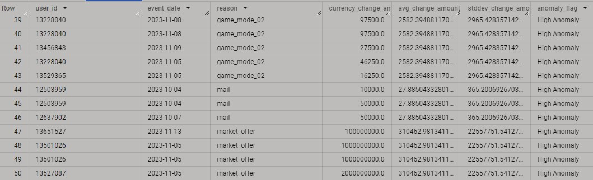

## 8. Veri setini inceleyerek kendi analiz etmek istediğiniz bir soruyu oluşturarak cevabını ve yorumlarınızı paylaşınız.

## **Oyuncuların seviye atlama hızları ile harcama ve retention davranışları arasındaki ilişkiyi açıklayan bir tablo oluşturunuz.**

### AMAÇ

**Seviye İlerleme Hızı**: Hangi oyuncular belirli bir zaman diliminde hızla seviye atlıyor? Bu oyuncular, diğerlerine göre daha fazla mı harcama yapıyor?

**Harcama Davranışı**: Hızlı seviye atlayan oyuncular hangi oyun içi satın alımlar veya fırsatları (market_offer, offer_popup) daha fazla kullanıyor? Harcamalar `gain/spend` açısından nasıl dağılıyor?
**Retention ve Aktiflik Durumu**: Hızlı seviye atlayan oyuncuların retention oranı nasıl? Bu oyuncular daha uzun süre aktif mi kalıyor, yoksa hızlı seviye atlayanlar arasında erken oyunu bırakanlar var mı?
**Başarı Oranı**: Seviye ilerleme hızına göre oyuncuların başarı oranları nasıl? Daha hızlı seviye atlayan oyuncular daha başarılı mı yoksa başarısız mı oluyor?
Kısaca bu soruyla oyuncuların oyun içi **başarı ve başarısızlık oranları**nı, **oyun süresin**i (survival time), harcama davranışlarını (gain/spend), oyuncunun **aktif** mi yoksa **churned** mı olduğunu analiz etmeyi amaçlıyoruz.
**Bu tablo, oyun içi ekonomi ve oyuncu davranışları arasındaki bağlantıları daha iyi anlamamıza yardımcı olacak**

```sql
WITH stage_results AS (
    -- Oyuncu başına başarı ve başarısızlık oranlarını hesaplıyoruz
    SELECT
        s.user_id,
        s.event_date,
        COUNTIF(s.result = 'win') AS wins,
        COUNTIF(s.result = 'fail') AS fails,
        COUNT(*) AS total_attempts,
        AVG(CAST(s.survival_time AS FLOAT64)) AS avg_survival_time  
    FROM
        game-analysis-01.project_game_v2.stage_events s
    GROUP BY
        s.user_id, s.event_date
),
currency_stats AS (
    -- Oyuncu başına harcama davranışlarını topluyoruz
    SELECT
        c.user_id,
        c.event_date,
        SUM(CAST(c.currency_change_amount AS INT64)) AS total_spent, 
        COUNTIF(c.change_type = 'Spend') AS spend_count,
        COUNTIF(c.change_type = 'Gain') AS gain_count
    FROM
        game-analysis-01.project_game_v2.currency_changes c
    GROUP BY
        c.user_id, c.event_date
),
retention_status AS (
    -- Oyuncu retention durumunu hesaplıyoruz
    SELECT
        user_id,
        MIN(event_date) AS first_play_date,
        MAX(event_date) AS last_play_date,
        CASE
            WHEN MAX(event_date) < DATE_SUB(CURRENT_DATE(), INTERVAL 7 DAY) THEN 'Churned'
            ELSE 'Active'
        END AS player_status
    FROM
        game-analysis-01.project_game_v2.stage_events
    GROUP BY
        user_id
)
-- Her bir adımı birleştiriyoruz
SELECT
    sr.user_id,
    sr.event_date,
    sr.wins,
    sr.fails,
    sr.total_attempts,
    ROUND((sr.wins / sr.total_attempts) * 100, 2) AS success_rate,
    ROUND((sr.fails / sr.total_attempts) * 100, 2) AS fail_rate,
    sr.avg_survival_time,
    COALESCE(cs.total_spent, 0) AS total_spent,
    COALESCE(cs.spend_count, 0) AS spend_count,
    COALESCE(cs.gain_count, 0) AS gain_count,
    rs.player_status
FROM
    stage_results sr
LEFT JOIN
    currency_stats cs ON CAST(sr.user_id AS STRING) = CAST(cs.user_id AS STRING) 
    AND sr.event_date = cs.event_date
LEFT JOIN
    retention_status rs ON CAST(sr.user_id AS STRING) = CAST(rs.user_id AS STRING)
ORDER BY
    sr.event_date, sr.user_id;
```

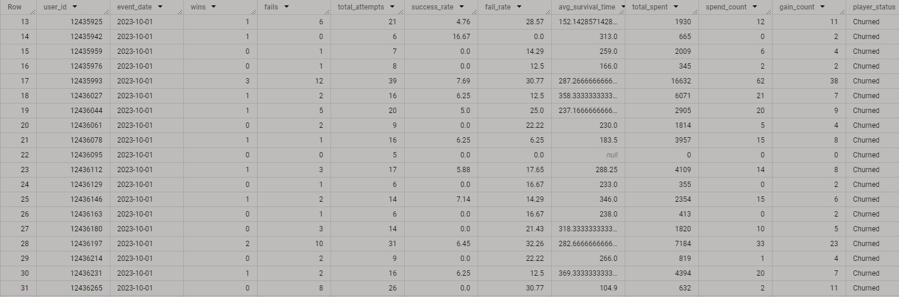

**Bu güzel projeyle uğraşma alanı açtığınız için teşekkür ederim.**

**Muhammet Uzun**
